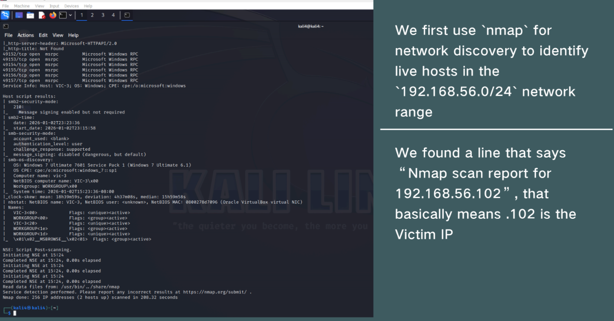
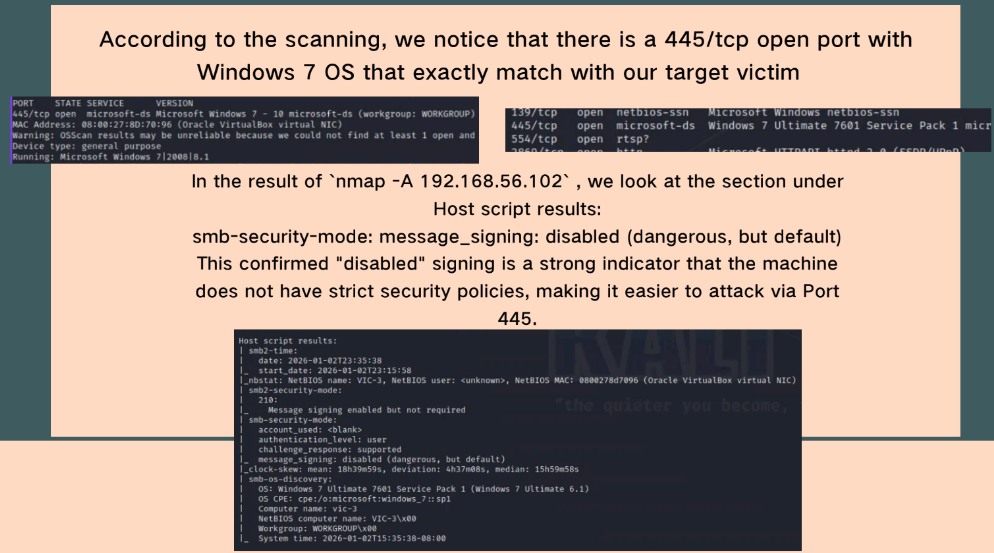
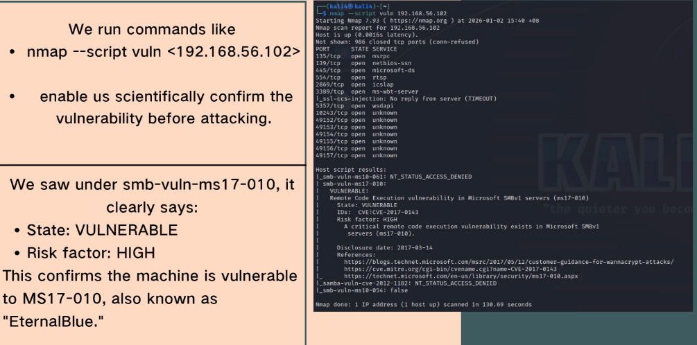
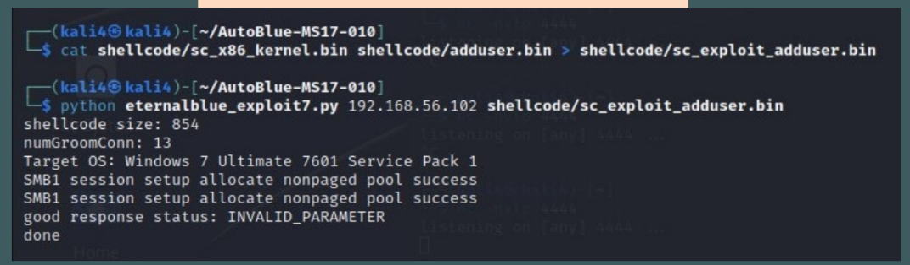
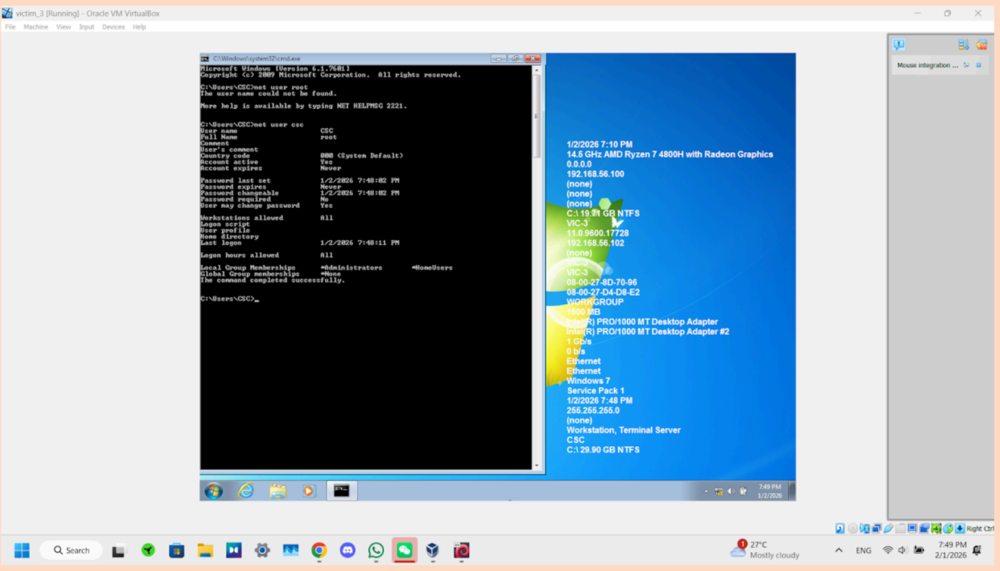

# Windows 7 Penetration Testing (MS17-010 Exploit)

## 📖 Overview
This project demonstrates a penetration testing scenario targeting a vulnerable Windows 7 machine using the MS17-010 (EternalBlue) vulnerability.

The objective was to simulate a real-world attack in a controlled lab environment, from reconnaissance to full system compromise.

---

## 🎯 Objectives
- Identify target machine in network
- Perform vulnerability scanning
- Exploit known vulnerability (MS17-010)
- Gain SYSTEM-level access
- Perform post-exploitation tasks

---

## 🏗️ Methodology

### 1. Reconnaissance
- Used Nmap to scan network
- Identified target IP: 192.168.56.102

---

### 2. Enumeration
- Found open port: 445 (SMB)
- Detected Windows 7 OS
- SMB signing disabled

---

### 3. Vulnerability Scanning
- Confirmed MS17-010 vulnerability using Nmap scripts

---

### 4. Exploitation
- Attempted Metasploit exploit (failed due to architecture mismatch)
- Switched to AutoBlue-MS17-010 tool
- Successfully executed exploit

---

### 5. Privilege Escalation
- Created new user account
- Elevated privileges to Administrator
- Gained SYSTEM-level access

---

### 6. Post-Exploitation
- Extracted password hashes (hashdump)
- Attempted cracking using John the Ripper
- Reset user password directly

---

### 7. Final Result
- Achieved full system compromise
- Verified highest privilege:

---

## 🧠 Key Learnings
- Understanding of vulnerability exploitation (MS17-010)
- Importance of enumeration before exploitation
- Handling failed exploits and adapting strategy
- Practical penetration testing workflow

---

## 🛠️ Tools Used
- Kali Linux
- Nmap
- Metasploit
- AutoBlue-MS17-010
- John the Ripper
- Windows 7 Virtual Machine
---
## ⚠️ Disclaimer
This project was conducted in a controlled lab environment for educational purposes only. No unauthorized systems were targeted.
